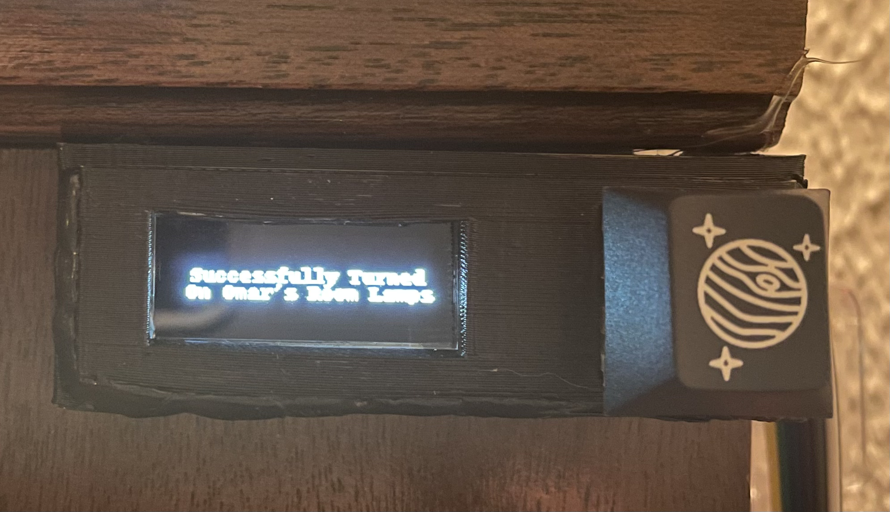

# RPi-Connect

Project based on the Tuya IOT API to turn on smart outlet controlled devices and an LED strip with a push button and an OLED.

## Web Setup

First, follow the [guide](https://developer.tuya.com/en/demo/python-iot-development-practice) to create an IOT project on a Tuya Devoloper account, then replace the device IDs and secret keys with the ones generated for you by Tuya.

## Hardware

Download and 3D Print the CAD from my [Thingiverse](https://www.thingiverse.com/theengineermachine/designs)

Wire a push button to the 3.3V and GPIO 18 pin and wire the OLED SCK, SDA, VCC, and GND to the according Raspberry Pi's GPIO pins. Do the same for the power wires on the LED strip, and connect the data pin to GPIO 30.

Glue the OLED into place so it's aligned with the screen hole. The mechanical keyswitch should click into place.

## Raspberry Pi Setup

Type `sudo raspi-config` into the terminal and enable the I2C Interface and then reboot the Pi.

Add the script to the Raspberry Pi's desktop and then configure crontab by running `crontab -e` and add
`@reboot python /home/pi/*path/to/file.py*`.
